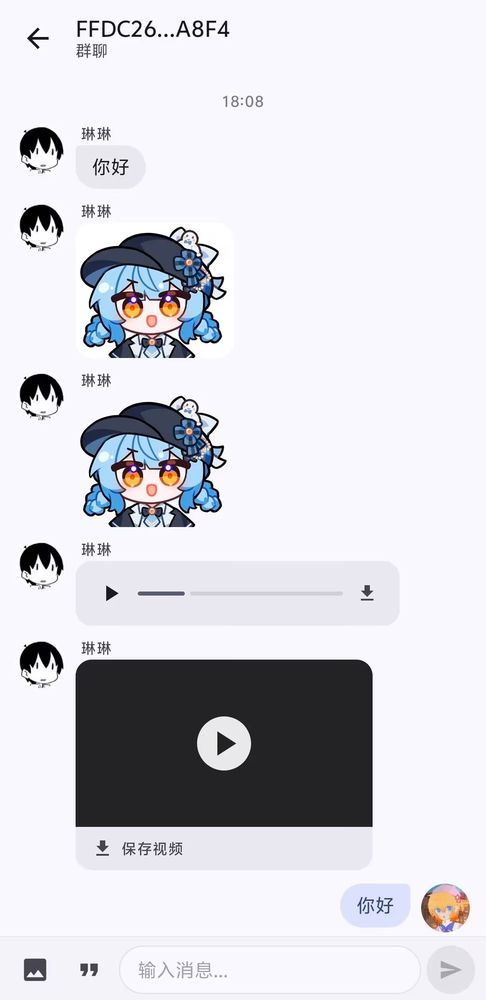

# NotEnoughFakeQQBot

Android 客户端，配合 [not-enough-fakeqqbot](https://github.com/ArilyChan/koishi-plugin-not-enough-fakeqqbot) Koishi 插件使用，提供类似 QQ 的聊天体验。

## 功能

- 消息收发（文本、图片、语音、视频、文件）
- 本地消息缓存 + 全文搜索（Room + FTS）
- 增量同步 + WebSocket 实时推送
- 语音在线播放（SILK 解码）
- 视频在线播放（ExoPlayer）
- 文件/媒体下载
- 图片本地缓存
- 会话备注名
- 快捷短语
- 未读消息计数
- 系统通知（支持备注名显示）
- 前台 Service 保活
- 开机自启

## 截图

## 配置

1. 确保 Koishi 已安装 `not-enough-fakeqqbot` 插件并启动
2. 打开 APP，输入服务器地址（如 `http://192.168.1.100:5140`）和 API Token
3. 连接成功后自动同步消息

## 构建

使用 Android Studio 打开项目，Gradle sync 后直接 Build。

- minSdk: 29 (Android 10)
- targetSdk: 36
- Kotlin + Jetpack Compose + Material 3

## 依赖

- Jetpack Compose (BOM 2024.09.00)
- Room 2.7.1
- Retrofit 2.11 + OkHttp 4.12
- Coil 2.7 (图片加载)
- Media3 ExoPlayer 1.5.1 (音视频播放)
- SilkDecoder 1.0 (QQ 语音解码)
- DataStore Preferences
- Navigation Compose

## License

MIT
